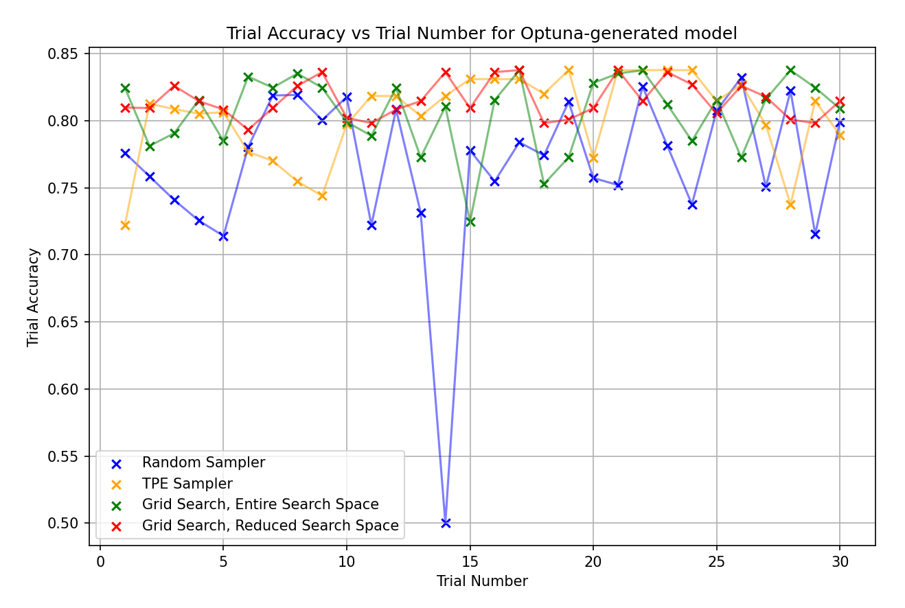
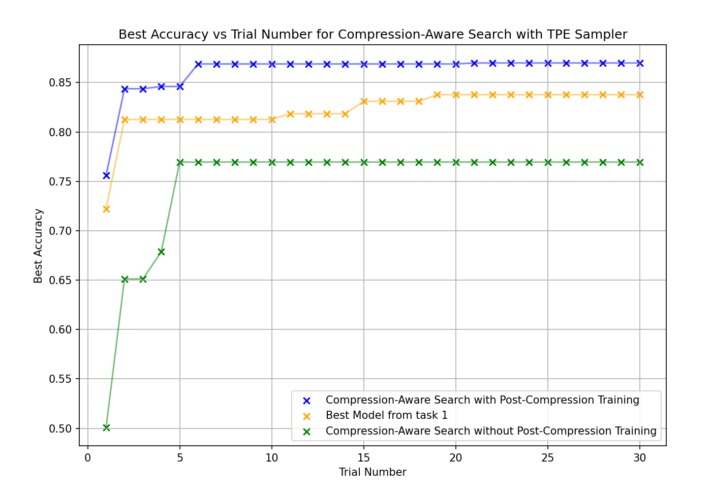

# Lab 0

## Tutorial 1

### Key Definitions and Summary

The main flow of this tutorial is from pretrained model (Bert specifically) to FX Graph (in FX IR). This is then raised to the Mase IR, upon which we can run passes.

FX Graph - A compute graph which offers a high-level representation of the computation. It is also PyTorch native, meaning that each operator in the graph correlates to a Python object or callable. We can transform and optimize the graph, and regenerate the Python to run it!

Mase IR - The key benefit of Mase IR is that it offers a common abstraction layer for both hardware and software workloads. It also incorporates information regarding the workload that is to be run by the graph. 

Mase IR allows a focus on hardware-specific metadata like quantization formats and hardware backend targets, whilst still keeping Python-native transformation.


### FX Graph -> Mase IR

We run a few analysis passes which annotate each node with relevant metadata.

**init_metadata_analysis_pass**: initialises a `MaseMetadata` object for each node in the graph, which behaves like a dictionary and is stored under `node.meta["mase"]`. Each metadata instance has the following structure, which is empty at initialisation.

```python
        node.meta["mase"] = {
            "common": {},
            "hardware": {},
            "software": {},
        }
```

**add_common_metadata_analysis_pass**: populates the `node.meta["mase"]["common"] dictionary by executing the following two steps. 
- **Operator inference**
Annotate the MASE operator associated with each node in the graph from its fx graph operator and target 
- **Shape Propagation**
This involves running a forward pass of the entire model with a provided dummy input and observing the arg and result for every node in the graph


### What we do

What we essentially do is to take a model, generate a MaseGraph of it, such that we can execute passes. These passes are able to analyse or transform nodes in the graph.

- **Analysis passes**: extract some information about each node, annotate nodes with relevant data, and generate payloads to be used by subsequent passes.
- **Transform passes**: change the topology of the graph by inserting, removing or replacing nodes.

Writing an analysis pass can be done using the `get_logger` API from Machop; in this tutorial we specifically use to count the number of dropout layer (6 of them). This is important as they only have meaning in the training stage, and can be removed for inference.

Once those have been picked out, the graph is again exported to have further optimisations done on it.

## Tutorial 2

### Key Definitions and Summary

This tutorial focuses on how we finetune pretrained models from HuggingFace. In this example we do so with two options - first, SFT (Supervised Fine Tuning), second, LoRA ([Low-Rank Adaptation](https://arxiv.org/abs/2106.09685)). The model is for sentiment analysis of the IMDb dataset.

### What we do

We take the tokenized IMDb dataset, and the model is loaded as a MaseGraph. We can then apply both methods of finetuning with the Machop `trainer` method.

With tools available to us in Mase, we can inject the LoRA adapter and perform a pass of the graph. We generate a custom MaseGraph using arguments.


**Task:** Remove the `attention_mask` and `labels` arguments from the `hf_input_names` list and re-run the following cell. Use `mg.draw()` to visualize the graph in each case. Can you see any changes in the graph topology? Can you explain why this happens?

When the graph is drawn without the attention mask and label arguments, those values aren't passed into the model, and don't appear on the graph topology.

The graph below is drawn with the attention mask and label arguments


The graph below is drawn without the attention mask and label arguments


The main changes are the attention mask that gets added instead of simply a tensor of ones (attention mask helps when we need to pad sequences to keep them equal length, so the mask will extract the useful tokens), and the cross entropy loss module that is called at the end due to labels ([ref](https://huggingface.co/docs/transformers/en/glossary)).

LoRA allows us to achieve high accuracy whilst limiting memory usage, allowing control of parameters whilst fine-tuning memory hungry models like LLMs. Note that LoRA does not change inference time, as the low-rank matrices are merged back in, leaving the model with the same dimensions as before LoRA is applied.

$$
y = X (W + AB) + b
$$

All we do is change the lower rank matrices A and B, freezing the larger matrix W. B is initialised to 0, as we can start training exactly at the pretrained state, if both matrices were random, the initial output will be random noise added to the pretrained weights.

# Lab 1

## Tutorial 3

### Key Definitions and Summary

We take a finetuned model and run the PTQ (Post-Training Quantization) pass from Mase on it. This will reduce accuracy, whilst also reducing the precision of weights and biases, such that the model size reduces. When representing the model inputs, weights and biases using a 5 bit integer width and 5 bit fractional width representation as in the tutorial, we measure the following accuracies:

**Finetuned Model Accuracy:** 83.44%
**Post-PTQ Accuracy:** 81.58%
**Post-QAT Accuracy:** 84.04%

We try to restore the accuracy from before quantization using QAT (Quantization-Aware Training). This includes the model back into the training loop after the quantization pass, such that the model can optimize the new, lower-resolution weights for the dataset. As we can see from the results, this step results in a better accuracy than even before PTQ, with a lower memory requirement.

From the weights/biases present in the finetuned model, we observed that the range of values primarily lied between -1 and 1, allowing us to utilise very few bits allocated for the integer. This limited our search space to between 1 and 10 integer bits, where we found using more than 5 integer bits didn't provide a greater post-PTQ accuracy. With too little integer precision, the integer bits will be saturated, and unable to represent the true integer values.


Graph to show how the number of integer bits affect the accuracy. All these tests for integer precision were conducted with the fractional width left at 4. 

Having determined the minimum number of bits required to preserve integer precision (5), we could allocate up to all 27 remaining bits for fractional precision. When we search that space, we found our first peak of post-QAT accuracy at 5 fractional bits, with little improvement from beyond even 3 fractional bits of precision. Below 3 fractional bits, we suffer underflow and precision loss, resulting in much worse accuracy.


Graph to show how the number of fractional bits affect the accuracy.

Overall, from the graphs, we can see that QAT really improves our accuracy across the board, especially so with a lower number of integer bits, so much so that it can really seem agnostic to the number of integer bits - from 2 up to 7 bits we see less than a percentile improvement.

We can conclude that due to the significant accuracy improvements post-QAT, even 1 integer bit only loses us two percent accuracy, so using an 8-bit wide, Q3.5 format is a good mix of precision and speed/storage savings.

## Tutorial 4

### Key Definitions and Summary

Pruning is used to reduce the size and complexity of the neural networks we build, by removing parameters or structural components. The goal is to produce a more efficient model that maintains a lot of the original model's performance.

- Structured Pruning: removes whole structures from the network.
- Unstructed Pruning: removes individual weights or connections from the network.


Graph to show how Random and L1-Norm pruning affect accuracy.

As sparsity increases, accuracy drops for both methods, reflecting the loss of model capacity as a larger fraction of parameters are removed. We can see that L1-Norm pruning is significantly more robust, with higher accuracy than random pruning for all values of sparsity.

Random pruning leads to a rapid drop in performance beyond sparsity 0.5, with accuracy collapsing to near random choice at sparsities of 0.7 and above. This indicates that random removal of weights quickly disrupts critical model structure.

L1-norm pruning has a higher accuracy for all sparsity levels. Performance drops more gradually, remaining somewhat stable up to sparsity 0.7 before a sharp decline at 0.9. This suggests that magnitude based pruning is more effective in preserving informative parameters by preferentially removing weights with lower contribution.

Finetuning shows a massive recovery for random pruning at lower sparsity levels (0.1-0.5) but L1-norm requires less finetuning help until very high levels of sparsity levels, at which point it presents moderate recovery.

Unstructured pruning will not provide a speedup on standard hardware. This is because the GPU will still perform multiply-accumlate operations on the zeroes. To see a speedup, we should use structured pruning (removing whole rows and columns).

# Lab 2

## Tutorial 5

### Summary

In this tutorial, we use different samplers to search for Bert model hyperparameters and construct a Bert model which determines the sentiment of a movie review in the imdb dataset.


## Task 1


### Sampling Method Perf. Evaluation

In order to evaluate each sampling method, we first run each sampler on the entire search space provided in the tutorials. 

Optuna's RandomSampler() randomly selects hyperparameter values from the search space. We found that this produced a best test accuracy of 0.8321 after 30 trials. However, as shown in the graph, the sampler struggles to consistently improve the best accuracy as the number of trials increases. Individual trial accuracies also remain highly variable. For example, in trial 13, the constructed model achieved an accuracy of only 0.5, despite the best accuracy up to that point being over 0.8. This indicates that random search may require a large number of trials to reliably discover near-optimal architectures.

Optuna's `TPESampler()` will use Gaussian Mixure Models (GMMs), where one GMM `l(x)` is trained using the hyperparameters which has given test accuracies within the top 25% of all models evaluated, and another GMM `g(x)` is trained based on the hyperparameters which has given test accuracies within the bottom 75% of all models evaluated. This split is controlled by a parameter to TPESampler known as gamma, and helps balance exploration of new hyperparameters with exploitation of the existing best hyperparameters found. The TPESampler will pick the set of hyperparameters which will maximise `l(x)/g(x)`. While this method gradually converges to trialling better hyperparameters, there are instances where it may trial the same set of hyperparameters multiple times, since it may not explore the search space as aggressively as the number of trials increases, which may mean that the TPESampler becomes "stuck" at a local optimal set of hyperparameters in the search space. This may be mitigated through increasing the value of gamma.

Optuna's `GridSampler()` will perform a grid search over the entire search space, so it may require a large amount of trials before finding hyperparameters that give a good test accuracy. Unlike `TPESampler()` and `RandomSampler`, `GridSampler` requires a search space for grid search which means that it will only trial hyperparameter combinations within the search space. In the search space, there are 153600 possible hyperparameter combinations, so for a limited number of trials, Optuna's `GridSampler()` may not find the near-optimal set of hyperparameters quickly. In order to limit the search space, the number of linear layers in the Bert encoder can be set to be the same as the number of linear layers in the best model architecture found by the `TPESampler()`, and the `num_layers`, `num_heads` and `hidden_size` can also be limited to only include values which formed part of a hyperparameter combination which achieved an accuracy of above 0.8 with the `TPESampler()`. This means that the search space was limited to 60 hyperparameter combinations.

In the graph below, the best accuracy achieved against the number of trials is plotted for Optuna's `RandomSampler()`, `TPESampler()`, the `GridSampler()` with the entire search space, and the `GridSampler()` with a limited search space determined by the `TPESampler()`. 


Both the `GridSampler()` and the `TPESampler()` produce a similar test accuracy, however the `TPESampler()` requires more trials to reach its best accuracy since it will not select hyperparameter values from a predefined search space, meaning that it must explore different hyperparameter values initially before only trialling hyperparameter values similar to those that have previously produced high test accuracies. The `RandomSampler()` is noticably worse than the other 2 samplers, since it will randomly select hyperparameter values, so even in the later trials (e.g. trial 14), the `RandomSampler()` will construct models that produce a very low test accuracy.

In the graph below, the trial accuracy achieved against the number of trials is plotted for Optuna's `RandomSampler()`, `TPESampler()`, the `GridSampler()` with the entire search space, and the `GridSampler()` with a limited search space determined by the `TPESampler()`. 




Overall, the TPESampler produces a good test accuracy and the best balance between exploration and exploitation under a limited trial budget, and is therefore selected for use in the compression-aware search in Task 2.

## Task 2


In this task, the test accuracy will be computed on the quantised and pruned model, so the objective of the study is to maximise the test accuracy of the compressed model, making the search compression-aware. Optuna `TPESampler()` yielded the best results in Task 1, so it will be used to run the compression-aware search. For the first experiment, the model will be trained for 1 epoch then compressed, so the objective is to maximise the test accuracy of the model found using Post-Training Quantisation and Pruning. For the second experiment, the model will be trained for 1 epoch, compressed, then trained for 1 more epoch to investigate whether fine-tuning the compressed model can recover the test accuracy to be similar to the best model found in Task 1 without compression.





# Lab 3

## Tutorial 6

### Task 1: Per-Layer Bit Width Search

In the original template code, all `LinearInteger` layers use the same hardcoded configuration (width=8, frac_width=4). We modified the search to let Optuna's `TPESampler` choose the width [8, 16, 32] and fractional width [2, 4, 8] independently for each layer. This configuration is as requested by the question. A graph of the improving model accuracy is shown below. On each Optuna trial, if the accuracy of the configuration is higher, the best configuration of the best model so far is updated. At the end only the best model is retained.


### Task 2: Multi-Precision Type Search

As requested in the question, the configuration search is then extended to include multiple precision types: `LinearInteger`, `LinearMinifloatDenorm`, `LinearMinifloatIEEE`, and `LinearLog` etc. 

* `LinearInteger` uses fixed-point arithmetic, where the total bit-width and the split between integer and fractional bits are explicitly controlled. This approach is useful because standard integer arithmetic hardware units can be used for basic operations. The main disadvantages are the limited dynamic range and the need for careful manual tuning of bit-widths. If the data spans a large range of values, fixed-point representations can quickly become unsuitable.

* `LinearMinifloatIEEE` follows the IEEE-754 floating-point rules but with customisable bit-widths. Its main advantage is that it inherits the benefits of floating-point arithmetic, particularly automatic handling of very large and very small values through a wide dynamic range. However, when using non-standard bit-widths, it is less hardware-friendly, as it does not map as cleanly onto simple integer execution units.

* `LinearMinifloatDenorm` is similar to `LinearMinifloatIEEE` but includes support for denormalised numbers. This improves the representation of very small values close to zero, reducing underflow effects. The disadvantages are additional complexity in both representation and hardware support.

* `LinearLog` stores the logarithm of a value rather than the value itself. An advantage of this representation is that certain operations, such as multiplication, can be implemented as simple additions. The number line is logarithmically spaced, giving good relative precision for small values. However, values extremely close to zero cannot be represented, which makes this format unsuitable for such cases.

The below graph shows the performance of these different precision types.


`LineaerMinifloatDenorm` achieves the best accuracy (86.02%), with `LinearMinifloatIEEE` close behind (85.99%). Our experiments also considers the case where a model could use a mix of all of these strategies, Optuna was configured to search a mix of these precision types. To give this run a higher chance of reaching an optimal model, 50 trials were used for this larger search space. Shown below is the graph of the improving accuracies against the trial index. 


Lets visualise the distribution of these different layer types in the final chosen best model:


This search focuses on maximising model accuracy, so compression techniques such as LinearMinifloatDenorm are preferred due to their higher compression ratios and improved numerical representation. Performance considerations are out of the scope. Consequently, inference time and other performance metrics should not be expected to be strengths of these model architectures.


# Lab 4

## `torch.compile`

This makes PyTorch models run faster by optimising the model and input data. It is a JiT compiler that optimises for specific hardware. It will essentially compile from Python to machine code at runtime, analysing slow parts of the code that it can recompile as needed.

The three main components of this compiler are:

- TorchDynamo: Captures the PyTorch graph by hooking into CPython.
- AOT Autograd: Captures the backward pass (gradients) ahead of time.
- TorchInductor: The backend that generates the optimized code (often using OpenAI Triton for GPUs).


## Model Runtime

The runtime of the optimised model is higher, when run for 5 iterations. However, when the iteration count is increased to 50, the optimised model is indeed faster. 

This demonstrates that the compilation does indeed make the model run faster on average, but at 5 iterations the compilation overhead isn't outweighed by the model speedup.

| Hardware | Iterations | Baseline Runtime (s) | Optimised Runtime (s) | Speedup |
| :--- | :--- | :--- | :--- | :--- |
| **CPU** | 5 | 1.8944 | 11.4648 | 0.17x |
| **CPU** | 50 | 1.5581 | 1.1766 | 1.32x |
| **CPU** | 200 | 1.6352 | 1.3449 | 1.22x |
| **GPU (RTX 4080)**| 5 | 0.0261 | 0.0205 | 1.27x |
| **GPU (RTX 4080)**| 50 | 0.0251 | 0.0205 | 1.22x |
| **GPU (RTX 4080)**| 200 | 0.0250 | 0.0206 | 1.21x |

On a GPU, the runtime does improve, but by a smaller amount, and the compilation benefits aren't scaled on increasing numbers of runs. This implies that the baseline GPU performance was already highly efficient, leaving less room for JIT improvements.

## Kernel Fusion

This is advantageous as it reduces the number of memory accesses as well as the number of kernel launches, making numerous small operations cheaper by fusing them together. 

For example, a linear layer followed immediately by a ReLU operation on the data, need not be executed by two separate kernels (with a corresponding read and write back to global memory for each), and instead have it's intermediate values in registers whilst the ReLU is operated, saving bandwidth to the global memory on GPU.

PyTorch does provide these fused kernels for common operations, an example being SDPA (Scaled Dot-Product Attention).

| Hardware   |   Iterations |   Original Runtime (s) |   Fused Runtime(s) |   Speedup |
|:---------|-------------:|---------------:|------------:|----------:|
| CPU      |            5 |       0.005323 |    0.003605 |  1.476353 |
| CPU      |           50 |       0.005025 |    0.003576 |  1.405349 |
| CPU      |          200 |       0.005110 |    0.003851 |  1.326901 |
| GPU (RTX 4080)     |            5 |       0.000136 |    0.000071 |  1.920646 |
| GPU (RTX 4080)     |           50 |       0.000068 |    0.000019 |  3.607179 |
| GPU (RTX 4080)     |          200 |       0.000070 |    0.000019 |  3.611273 |

With kernel fusion on the GPU, we can clearly see the benefits in terms of speedup. The fused kernel reaches speedup of 3.6x as opposed to 1.3x on the CPU. This is because GPUs are memory-bound, with their operation speed limited by memory latency when reading/writing values from main memory.

On the GPU, amortization effects are stronger at higher iterations. At a low number of iterations, fixed overheads like CUDA kernel launch latency and Python dispatch make up a larger percentage of the total runtime.

The CPU does benefit from better cache locality due to the fused kernel, but the massive memory latency paid by GPUs isn't present, meaning the performance boost is a little more modest.

## Custom Kernels

These are the most powerful way to optimise code performance, but require a bit more legwork. We should write these kernels manually, when we want to implement a custom operation, as opposed to ones provided by PyTorch, Intel or NVIDIA as some examples.

Our custom kernel is for dequantization, making the quantized values back into floating-point values. 

### MXINT8 Quantization


The CPU algorithm to convert from MXINT8 to BFloat16 is explained below.

```cpp
    for (int i = 0; i < M; ++i) {
        auto sign = static_cast<uint16_t>(hX[i] & 0x80) << 8; // The signed bit is the MSB of the 16-bit BFloat16 representation
        auto exp = static_cast<uint16_t>(hScales[i / group_size]) << 7; // Take the shared exponent, shift by 7 since you want to align 1 bit before sign bit
        auto mantissa_abs = abs(hX[i]); // Taking an unsigned 8-bit representation
        auto frac = static_cast<uint16_t>((mantissa_abs & 0x3F) << 1); // Since BFloat16 has an implicit leading bit, we take 6 bits (S | i | 6-bit fraction) (not the signed bit or the MS positive bit), then shift left by 1, since MXINT8 has a 6-bit fraction while BFloat16 has a 7-bit fraction
        auto out = cutlass::bfloat16_t::bitcast(sign | exp | frac); // Bitwise Or on all the bits
        auto dont_need_abs = bool(mantissa_abs & 0x40); // Check the value of the integer bit that is implicitly 1 in BFloat16
        auto bias = cutlass::bfloat16_t::bitcast(sign | exp | uint16_t(0)); 
        y[i] = dont_need_abs ? out : out - bias; // Subtract the bias if the bit that is implicit is zero, since it will be 1 in BFloat16 (bias represents ±1.0 × 2^exp)
    }
```

If both the weights and activation are quantized to the format, the GPU is able to leave them in that format and compute the answer, as opposed to having to dequantize either one or the other, requiring more computation. With both weight and activation in integer form, the hardware is able to use a mathematical trick, performing the full operation in integer math, only using expensive floating point scales once at the end of the block.

With quantized values, the physical hardware (integer multipliers) take up less space on the silicon chip, saving area and allowing designers to fit more multipliers on the chip.

### dont_need_abs and bias

These are computed from the input value. They are used to determine if the MXINT8 value has a real leading one in its mantissa (7th bit) - that's what (mantissa_abs && 0x40) is doing (is our value 1.0.. or 0.0...?). If so, we know we can allow the hardware to insert it's leading 1 as it would do for typical floating point values. If not, we make sure to subtract the bias (correctly signed, shifted, 1.00000) at the end, representing values smaller than 1 correctly.

### cta_tiler and local_tile

The `cta_tiler` is used to split up the representations of the full matrices into tiles, such that the work can be divided across CTAs (Compute Thread Arrays). We give a desired CTA tile size (shape), such that the `cta_tiler` can split up the tensors across the CTAs. 

This separates the global tensor into a grid of tiles. The `local_tile` function then selects a specific tile corresponding to the CTA's coordinates (like `blockIdx.x` and `blockIdx.y`). Finally the CTA can now use the view of that single tile to perform computation on.

This doesn't actually "copy" the data in a literal sense from global memory, instead using a pointer into global memory generated by the combination of `cta_tiler` and `local_tile`.

### layout_tX and local_partition

Having generated the tiles of global memory in the previous step, we want an efficient way to copy one tile of global memory to one tile of our shared memory. To speed this up, we can allow the threads in the CTA to copy their own subtensor of data.

We define the thread layout so we can partition the global memory tensors data and shared memory tensors. In this operation `local_partition` is a lot like `local_tile` except each thread gets one element of data assigned to it per thread tile.

This means that each thread can participate in the copy operation as they all own a different subtensor of the tile that is to be copied.

### Why is the saved GPU memory not what we expect?
Only the torch.nn.Linear is quantized
```python
for layer_name, layer in model.named_modules():
        if not isinstance(layer, torch.nn.Linear):
            continue
        if "classifier" in layer_name:
            continue
```
Specifically, the following were not quantized:
1. Encoder layers
2. Output layers (poolers, classifier, dropout)

Therefore a lot of the model is not quantized so it would not achieve the theoretical memory savings that we might expect.
